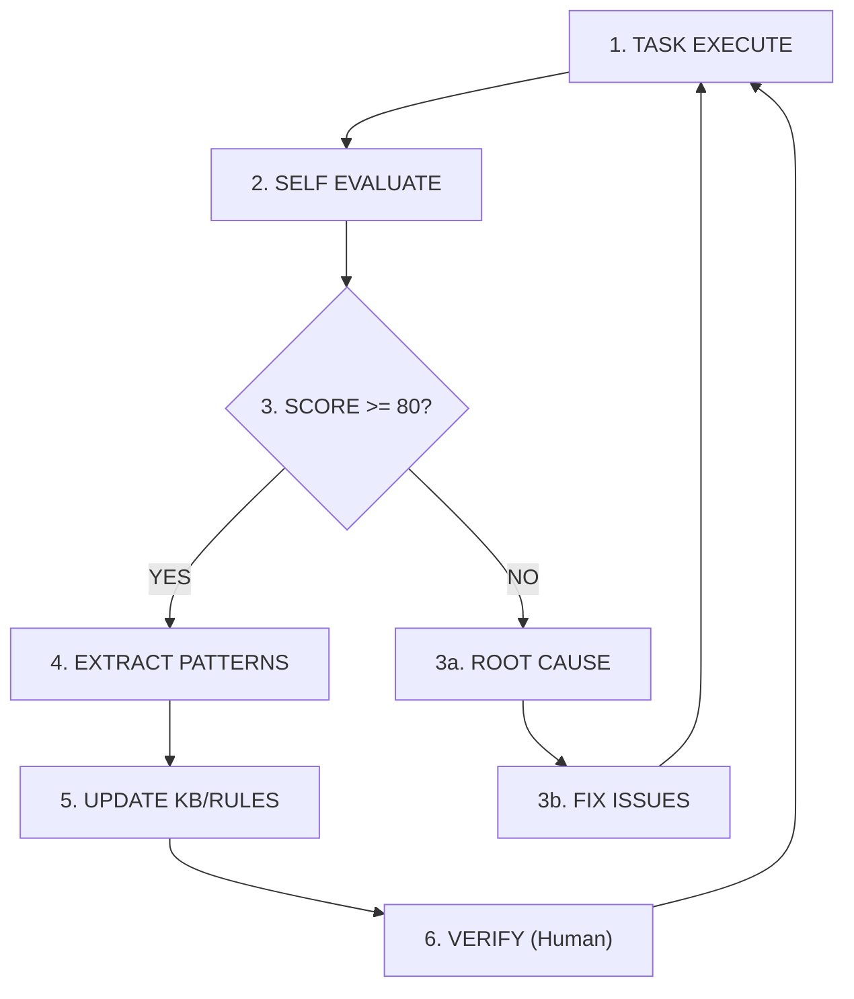
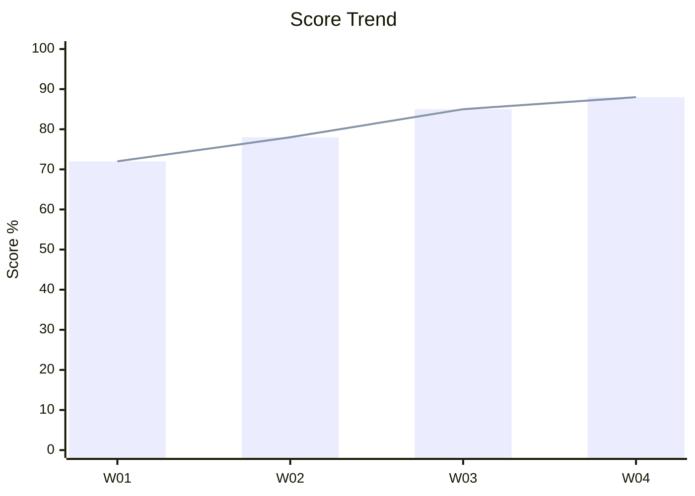

# Continuous Improvement Framework

For the live status table of pending or integrated improvement reports, see `./improvements/_registry.md`. That registry tracks proposal state; this file defines the framework and lifecycle.

## Overview

This document defines how the TP-AgentKit improves over time through systematic learning from completed tasks.

---

## 1. The Learning Loop



---

## 2. Evaluation Metrics

### 2.1 Quantitative Metrics

| Metric | Formula | Target |
|--------|---------|--------|
| **Completeness** | (Completed items / Total items) × 100 | >= 95% |
| **Correctness** | (Correct items / Total items) × 100 | >= 90% |
| **Efficiency** | (Minimum edits / Actual edits) × 100 | >= 80% |
| **First-Time Success** | (Tasks passed first time / Total tasks) × 100 | >= 75% |

### 2.2 Qualitative Metrics

| Metric | Assessment Method | Target |
|--------|-------------------|--------|
| **Convention Adherence** | Compare against rules/ | Full compliance |
| **Reference Usage** | Verify citations in walkthrough | Appropriate usage |
| **Documentation Quality** | Review walkthrough completeness | Clear & complete |

---

## 3. Pattern Extraction

### 3.1 When to Extract

Extract patterns when:
- Task scored >= 80% overall
- A novel approach was used successfully
- An error was resolved with a generalizable fix
- Human provided useful correction

### 3.2 Pattern Types

| Type | Store Location | Example |
|------|----------------|---------|
| Code Pattern | `.claude/knowledge/*.md` | ESM calculation |
| Flow Pattern | `.claude/knowledge/*.md` | Relative test insertion |
| Error Pattern | `.claude/knowledge/*.md` | Divide by zero handling |
| Platform Quirk | `.claude/knowledge/*.md` | OTPL macro syntax |

### 3.3 Shared Boundary Extraction Signal

When the same low-level mechanics appear across multiple skills, prefer extracting a narrow shared helper before the drift becomes policy or test noise.

High-leverage extraction signals:

- repeated CSV preview or row-loading logic with the same encoding fallback behavior
- repeated display-path normalization or workspace-relative path rendering
- repeated recursive file discovery or directory walking that differs only in filtering
- repeated `sys.path` bootstrap or shared support-module wiring copied into multiple skills

Boundary rule:

- extract only the generic mechanics that are staying the same across skills
- keep domain decisions local to each skill instead of pushing product logic into the shared helper
- treat encoding, path rendering, and recursive discovery as good shared-boundary candidates because they change repo-wide and are expensive to patch in many places

Promotion rule:

- if a repeated fix would otherwise require the same edit or smoke coverage in several skills, prefer a shared repo-local support module plus targeted regression around that boundary
- if the duplication is domain-specific or only appears twice with materially different semantics, keep it local until the common boundary is clearer

Verified repo example:

- the 2026-04-23 efficiency/effectiveness audit identified duplicated CSV ingestion, path rendering, and recursive walk logic across multiple TP-AgentKit skills
- the resulting `_io_support.py` extraction reduced repeated encoding and display-path fixes while keeping skill-specific decisions local

### 3.4 Pattern Template

```markdown
## Pattern: [Name]

### Problem
[What problem this pattern solves]

### Solution
[How to apply this pattern]

### Example
```[language]
[Code or configuration example]
```

### When to Use
- [Condition 1]
- [Condition 2]

### Caveats
- [Limitation or warning]

### Source
- Task: [Task name where pattern was extracted]
- Date: [Extraction date]
```

---

## 4. Knowledge Base Updates

### 4.1 Update Triggers

| Trigger | Action | Verification Required |
|---------|--------|----------------------|
| New pattern extracted | Add to `.claude/knowledge/*.md` | Yes (human) |
| Error fixed | Update an existing `.claude/knowledge/*.md` note or create a focused new one | No |
| Platform quirk found | Add to `.claude/knowledge/*.md` | Yes (human) |
| Existing pattern improved | Update the relevant `.claude/knowledge/*.md` file | Yes (human) |

### 4.2 Verification Levels

```yaml
status: raw       # Just extracted, unverified
status: partial   # Partially verified, use with caution
status: verified  # Human verified, trust fully
```

### 4.3 KB File Structure

```markdown
---
type: [pattern_type]
status: [raw|partial|verified]
verifier: [name or "auto"]
date: [YYYY-MM-DD]
---

# [Title]

## [Pattern 1]
...

## [Pattern 2]
...
```

---

## 5. Rule Updates

### 5.1 When to Add Rules

Add rules when:
- Same error occurs 3+ times
- Human explicitly requests rule
- Critical safety issue discovered
- Platform-specific requirement found

### 5.2 Rule Template

```markdown
| Area | Rule | Rationale |
|------|------|-----------|
| [Area] | [What must be done] | [Why it matters] |
```

### 5.3 Rule Verification

Rules affecting safety or correctness require human verification before activation.

---

## 6. Improvement Proposals

### 6.1 Proposal Format

When the agent identifies potential improvements, log them:

```markdown
## Improvement Proposal: [Title]

### Current Behavior
[What happens now]

### Proposed Change
[What should happen]

### Rationale
[Why this is better]

### Impact
- Files affected: [list]
- Risk level: [Low/Medium/High]

### Implementation
[Steps to implement]

### Status
- [ ] Proposed
- [ ] Under Review
- [ ] Approved
- [ ] Implemented
```

### 6.2 Review Process

1. Agent logs proposal in `knowledge/improvements/`
2. Human reviews during next session
3. If approved, agent implements during next task
4. Verification confirms improvement

---

## 7. Metrics Dashboard (Conceptual)

### Task History Summary

| Week | Tasks | Avg Score | First-Pass | Patterns Added |
|------|-------|-----------|------------|----------------|
| W01 | 5 | 72% | 60% | 2 |
| W02 | 4 | 78% | 75% | 3 |
| W03 | 6 | 85% | 83% | 1 |
| W04 | 5 | 88% | 80% | 2 |

### Trend Analysis



*Trend: Improving over time*

---

## 8. Human-in-the-Loop Checkpoints

### 8.1 Verification Points

| Checkpoint | Frequency | Purpose |
|------------|-----------|---------|
| KB Update | Each addition | Verify pattern accuracy |
| Rule Addition | Each addition | Confirm rule necessity |
| Low Score Review | Score < 70% | Identify systemic issues |
| Monthly Review | Monthly | Trend analysis |

### 8.2 Feedback Integration

When human provides feedback:

1. Log reusable framework feedback in `.claude/knowledge/improvements/`
2. If correction provided, apply immediately
3. If pattern, add to `.claude/knowledge/` with `status: verified`
4. If rule, add to `.claude/rules/` with human attribution

---

## 9. Anti-Patterns

### Things to Avoid

| Anti-Pattern | Problem | Alternative |
|--------------|---------|-------------|
| Over-extraction | Too many trivial patterns | Only extract when score >= 80 |
| Rule explosion | Too many conflicting rules | Consolidate related rules |
| Stale KB | Outdated patterns | Review on low scores |
| Ignoring errors | Same errors repeat | Add to common_errors.md |

---

## 10. Implementation Checklist

### For Each Completed Task

- [ ] Generate eval_report.md
- [ ] If score >= 80%, check for extractable patterns
- [ ] If score < 80%, perform root cause analysis
- [ ] Log any improvement proposals
- [ ] Update the active `.claude/artifacts/current_task/` note and refresh `INDEX.md` when the working set changed

### Weekly (Human or Automated)

- [ ] Review eval reports
- [ ] Verify new KB entries
- [ ] Review improvement proposals
- [ ] Update metrics dashboard

### Monthly (Human)

- [ ] Trend analysis
- [ ] Rule consolidation
- [ ] KB cleanup
- [ ] Framework improvement review

---

*This framework ensures the TP-AgentKit gets smarter with each task, building a domain-specific knowledge base tailored to your test program activities.*

