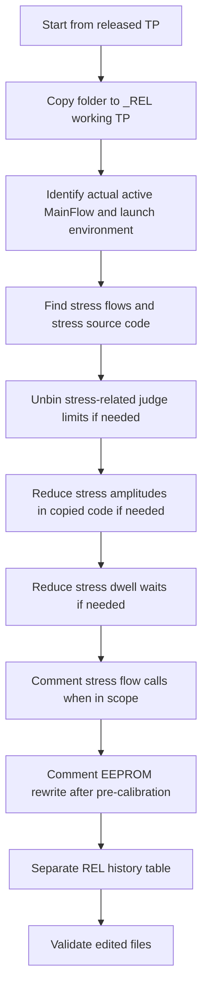

# TP Reliability Workflow

Reusable workflow for preparing a special TP for reliability return / post-conditioning usage, where the TP must not add extra device stress and must not rewrite device calibration content.

This pattern is intended for reuse in the agentic framework when a user asks for a TP to be adapted for REL usage instead of production screening.

## Problem Shape

Use this workflow when:

- parts have already seen pre-conditioning or reliability stress outside the TP
- the normal TP still contains drain-stress, energy-stress, calibration-write, or EEPROM rewrite behavior
- the user needs a REL-only TP that is safe to run after stress exposure
- the production TP must remain unchanged for comparison and traceability

---

## Core Rule

Default to copy-only REL work.

Create a dedicated REL copy and make all REL-specific changes only there.

### Explicit User-Target Exception

If the user explicitly asks to modify an already-selected target folder in place, treat that folder as the working REL target rather than forcing a new `_REL` copy.

In that case:

- preserve production-vs-special separation through naming, comments, and history structure
- do not silently broaden scope beyond the user-selected target folder
- make the non-production intent explicit in `RevHistory.txt`

### Why

- copy-only remains the safest default
- some repository tasks are phrased as adapting an already prepared target TP rather than creating a fresh copy
- forcing a new folder when the user already chose the target can create unnecessary fallout and review confusion

---

## Naming Pattern

If the user wants to keep the same production revision number, create the working folder by appending `_REL` to the source folder name.

Example:

- source: `testprogram/<source-revision>`
- REL copy: `testprogram/<source-revision>_REL`

This keeps the production revision recognizable while making the non-production REL purpose explicit.

---

## Workflow Summary



---

## 1. Copy-Only REL Preparation

1. Copy the source TP folder to a new `_REL` folder.
2. Keep the source TP untouched.
3. Apply all REL edits only in the copied folder.

### Why

- preserves the production baseline for WinMerge / diff review
- keeps REL-specific compromises out of the released production TP
- makes later rollback trivial

---

## 2. Stress Discovery Workflow

Before editing, inspect both flow-level and code-level stress behavior.

### Active Flow First

Before broad REL edits, confirm what the TP actually launches now.

Check:

- `tplConfigFile.cfg` for the selected `.tpl` and environment file
- `FlowDefs` in the selected `.tpl` for the actual `MainFlow`
- whether the selected program instance is FT-only, EWS-only, or multi-flow

### Why This Matters

- a file can contain stress routines that are inactive for the current TP launch path
- a helper source file can be compiled and still be irrelevant to the active flow
- minimal REL updates should prefer the active execution path first when the user explicitly wants the smallest possible delta

### Practical Rule

Classify each candidate edit into one of these buckets before touching it:

1. Active-flow required change
2. Inactive-flow optional hardening
3. Unused or debug-only helper

Do not apply bucket 2 edits by default when the user asks for a minimal REL conversion.

### Check in MainTestPlan

Look for:

- stress function calls such as `T_DRAIN_STRESS_HS`, `T_DRAIN_STRESS_LS`, `Energy_Stress`
- calibration calls such as `CALIBRATION, 0` and `CALIBRATION, 1`
- EEPROM rewrite calls such as `EEPROM_Write`
- active flow selection via `MainFlow = ...`

### Check in TestFunctions

Look for:

- `vsim(...)`
- `vsvim(...)`
- `isvim(...)`
- `WAIT(...)`
- global flags like `Energy_Stress`

### Important Distinction

There are two independent REL safety layers:

1. Flow-level safety: comment the stress call so the routine does not execute.
2. Code-level fallback safety: reduce amplitudes and waits inside the copied stress routine in case someone later re-enables the call.

### Calibration Classification Before Removal

Do not treat every calibration-named function as a DUT state-changing calibration.

Classify each function first:

1. DUT-state calibration or trimming path
2. ATE or instrument hardware calibration
3. Post-trim verification or readback helper

### Verified Practical Distinction

- `CALIBRATION` plus following `EEPROM_Write` is a DUT-state-changing path and is a valid REL target
- `MFHP_Calibration` is an ATE or hardware calibration helper and should usually remain unless the user explicitly wants it removed
- nearby verification steps such as `Trimming_post` should not be removed unless they actually write persistent device state

### Why This Matters

- removing ATE calibration can break measurement integrity without improving DUT reliability
- the REL goal is to avoid extra DUT stress or persistent DUT-state updates, not to disable harmless tester setup blindly
- name similarity alone is not sufficient evidence that a function writes EEPROM or NVM

### Minimal-Delta Exception

If the confirmed `MainFlow` does not call the stress routine and the user asks for a very small REL update, it is valid to leave inactive stress code unchanged.

In that case, document clearly that:

- the stress code still exists in the copied TP
- the active launch path does not execute it
- the REL change intentionally targeted only the active flow

---

## 3. Unbin Stress-Related Limits

If the user wants the stress checks to remain present for visibility but not fail the lot flow, unbin the stress-related judge entries in the copied limit sheet.

### Pattern

Keep the limit values, but change the bin in the tuple to `NoBin`.

Example shape:

```text
[ LL , UL , NoBin ]
```

### Why

- preserves datalog visibility
- prevents stress-related judge failures from setting fail bins
- avoids deleting test definitions unnecessarily

### Example

In one completed example, drain-stress related entries in the copied REL TP were unbinned across a contiguous judge-ID range instead of being deleted, so the datalog remained visible without driving fail binning.

---

## 4. Reduce Stress Amplitudes In Code

When REL safety still matters even if the stress flow is accidentally re-enabled, reduce the actual force conditions in the copied stress code.

### Drain Stress Reduction Pattern

Flatten the high-stress excursions back to the lowest already-established measurement level used by the same routine.

Example:

- original high excursion: `24V / 34V / 42V` or `24V / 34V / 40V`
- REL fallback: collapse those steps back to the existing `14V` measurement condition

### Selection Rule

Choose the lowest already-established non-stress or leakage measurement condition that the routine already uses, rather than inventing a new operating point without supporting context.

### Example Rationale

- the same routines already use `14V` for pre/post leakage checks
- it avoids inventing a new operating point that may break the routine semantics
- it removes the overstress excursion while staying inside a known-good bias condition

### Energy Stress Reduction Pattern

Reduce explicit high-current stress force to low nonzero values.

Example:

- `vsvim(20V, ..., 2A)` -> `vsvim(5V, ..., 10mA)`
- `isvim(1A, ..., 30V/-30V)` -> `isvim(10mA, ..., 5V/-5V)`

### Why Not Force Everything To Zero

- some routines still require a valid electrical setup state
- fully zeroing control/force values can turn the routine into a broken path instead of a benign path
- using a low nonzero fallback is safer when the flow remains callable

---

## 5. Reduce Stress Dwell Waits

Reducing amplitude alone is not enough. Any `WAIT(...)` that occurs while the DUT is still biased adds exposure time.

### Priority Order

1. Remove or minimize long stress dwell waits first.
2. Then reduce pre/post settle waits.
3. Keep only the minimum settling needed for the sequence to remain electrically sane.

### Wait Categories

#### True Stress Dwell

These are the highest-priority waits to cut:

- long waits like `WAIT(200*mS)` after the stress bias is applied

#### Extended Bias Settling

Also reduce these in REL copies:

- `WAIT(90*mS)`
- `WAIT(50*mS)`
- `WAIT(20*mS)`
- `WAIT(10*mS)`
- `WAIT(2*mS)`

### Example Pattern

Reduce these waits to `1*mS` as a minimum-settle fallback inside the copied stress code.

### Why

- if the stress call is accidentally restored later, the dwell no longer meaningfully extends exposure
- the code keeps a small settle margin instead of becoming a zero-delay edge case

---

## 6. Comment Out Stress Calls Entirely

For a true REL TP, the preferred action is to comment out the stress calls in the copied flow.

### Pattern

Comment the original line and add a short REL note.

Example:

```tpl
#  T_DRAIN_STRESS_LS," -- DRAIN_STRESS_LS Test Function --";  # REL: stress call removed
```

### Why This Is Better Than Only Reducing The Code

- prevents execution at the flow level
- makes the REL intent obvious in diff review
- preserves the previous call for future restoration

---

## 7. Remove EEPROM Rewrite After Pre-Calibration

If a normal TP performs a pre-calibration followed by `EEPROM_Write`, comment out the EEPROM rewrite in the REL copy.

### Pattern

Look for this shape in the flow:

```tpl
CALIBRATION, 0, " -- CALIBRATION pre --";
EEPROM_Write," -- EEPROM_Write --";
```

For REL usage, comment out `EEPROM_Write`.

### Why

- REL return testing should not rewrite trim / calibration content unless explicitly requested
- avoids changing device state after external reliability conditioning
- protects post-stress readback and comparison integrity

### Example

In one completed example, every copied main FT flow had the post-pre-calibration `EEPROM_Write` call commented out in the REL TP.

### Minimal-Delta Rule

If the TP has a single confirmed active `MainFlow`, and the user wants the smallest safe change, comment `EEPROM_Write` only in the active flow first.

Expand to other inactive flows only when:

- the user asks for broader REL hardening, or
- the TP is routinely switched between those flows in real use

### Verify Before Removing Adjacent Steps

Do not assume that every function between `CALIBRATION` and later parametric tests writes persistent memory.

For example, a post-trim verification function such as `Trimming_post` may only:

- apply temporary runtime setup
- measure values after trimming
- datalog and judge results

and may perform no EEPROM or NVM write at all.

Verify actual write behavior before removing nearby functions just because they are adjacent to `EEPROM_Write` in the flow.

---

## 8. Revision History Pattern For REL TPs

Do not mix REL-only entries into the normal production revision table if the REL TP is a special-purpose non-production workflow.

### Recommended Pattern

Create a dedicated REL history section or separate table below the normal production history.

Label it clearly, for example:

- `REL Special TP History - Reliability Use Only / Not For Production`

### Author Rule

Use the same author as the previous normal revision update when the REL TP is derived directly from that revision and the user requests continuity.

### Placement Rule

Append the REL special-history section below the normal production history table instead of inserting REL rows into the middle of the production stream.

If the task edits an existing non-production target folder in place, this separation becomes even more important because the folder name alone may not fully communicate the special-purpose intent.

### Why

- production history remains clean
- REL TP is clearly marked non-production
- future users can immediately distinguish special-purpose overlays from released TP evolution

---

## 9. Validation Checklist

Before marking the REL TP complete, verify:

- source production folder is unchanged
- `_REL` copy exists and contains all edits
- stress calls are commented in copied flow files
- stress-related limit entries are unbinned if required
- stress amplitudes in copied code are reduced
- stress dwell waits in copied code are reduced
- `EEPROM_Write` after pre-calibration is commented out in copied flow files
- REL revision history is separate from production history
- edited files have no parser or editor errors

---

## 10. Recommended Execution Order

1. Copy source TP to `_REL` folder.
2. Identify the actual active flow from cfg plus `FlowDefs`.
3. Identify active-flow stress/calibration/write call sites.
4. Identify inactive-flow optional hardening targets separately.
5. Identify stress-related limit IDs.
6. Unbin stress-related limits if required.
7. Reduce stress amplitudes in copied code if required.
8. Reduce stress dwell waits in copied code if required.
9. Comment out stress flow calls when they are in scope.
10. Comment out `EEPROM_Write` after pre-calibration.
11. Classify calibration-like functions before removing adjacent setup steps.
12. Split REL revision history into its own non-production table.
13. Re-check that only user-intended flows were changed at the flow level.
14. Validate edited files.

---

## 11. Practical Default Policy

For future REL TP tasks in this repository, the default policy should be:

1. Create a copy-only REL TP.
2. Comment out stress calls.
3. Comment out EEPROM rewrite after pre-calibration.
4. Unbin stress judge limits only if the user still wants visibility without fail binning.
5. Keep reduced stress amplitudes and reduced waits as fallback protection in the copied stress code.

This is safer than relying on any single mitigation alone.

When the user explicitly asks for a minimal update, refine the default policy to:

1. confirm the active flow first
2. distinguish DUT-state updates from ATE calibration before removing anything
3. remove only the active-flow persistent-write step first
4. leave inactive flow calls unchanged unless the user wants broader hardening
5. still consider code-level fallback stress reduction if the copied stress routine might later be re-enabled

---

## 12. Applicability Notes

- This pattern is strongest for Advantest T2000 RDK-style TPs where stress behavior is split across `.tpl`, `.ls`, and `TestFunctions/*.cpp`.
- The same method can be reused for other product families in this repository that need special REL-only handling.
- Always adapt the exact stress IDs, flow names, and rewrite points to the target TP rather than assuming the UR78 names apply everywhere.