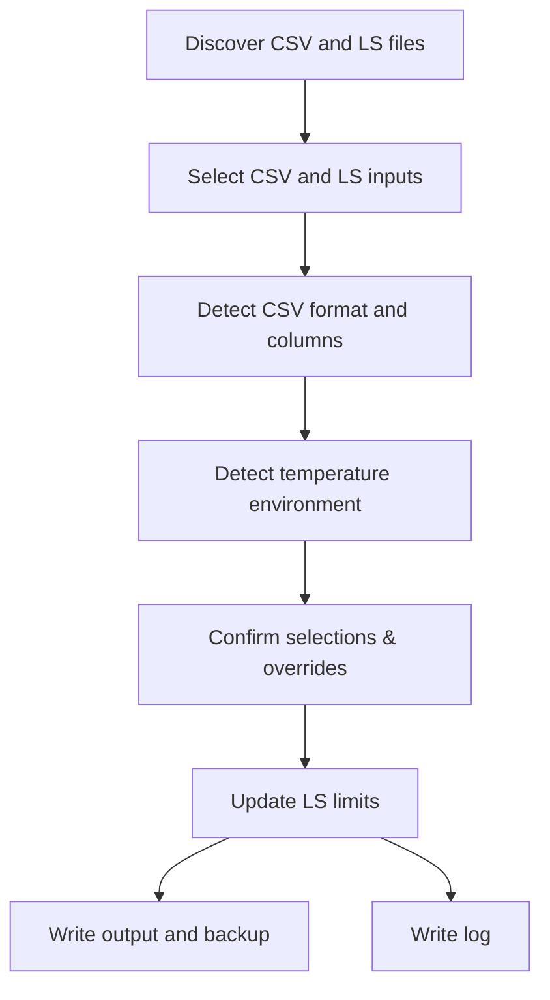

# T2K Limit Sheet (LS) Updater

Updates test limits in Advantest T2K `.ls` files using CSV exports. The script auto-detects CSV formats, preserves `.ls` formatting, and produces updated outputs with per-run logs.

Implementation note: `ls_updater.py` remains the entry point. CLI/prompt helpers and scale/unit audit helpers now live in local sibling modules so the tool stays stdlib-only while reducing monolith risk.


Validated Device: UR78, UR66, UR6H, UR6E

## Features

- **Auto test limit population** — LL/UL values are extracted from CSV columns and mapped to LS tests by test number.
- **Auto file discovery and selection** — CSV and LS files are auto-discovered under the workspace root. If only one CSV or LS file is found, it is auto-selected for convenience.
- **Multi-file support** — Multiple CSV and LS files can be selected in a single run.
- **Multi-format flexibility** — Supports multiple CSV formats (SPL, SPAT, O+) and LS formats (LimitDef macro, LimitDef per env, multi-env LimitTable).
- **UAE7 env-block support** — Supports live UAE7-style rows such as `T305 { FTC(...); FTH(...); }` and updates only the requested environment cell.
- **Auto column mapping and override** — CSV format (SPL, SPAT, O+) is auto detected. Optional **column override** allows adjustment of column mappings.
- **Auto temperature detection and override** — Environment is detected from filenames and LS content. Single LS env is used when CSV temperature is not detected. On conflict, choose CSV, LS, or **Override** to select another temperature.
- **Scale handling** — Converts between scale tokens (p, n, u, m, k, M, G) and base units automatically; no manual alignment of scale between CSV and LS required.
- **Unit handling** — Units are detected and preserved; if CSV and LS units mismatch, the test is skipped with a warning to prevent incorrect updates.
- **Invalid test handling** — Tests without value in CSV, non-numeric values, or that are commented out in LS are automatically skipped with warnings.
- **Same limit preservation** — If the new limit matches the existing LS limit, it is not updated to preserve original formatting and avoid unnecessary changes.
- **Precision override** — Optional precision override (1–3 decimal places), dynamic precision (`+1` decimal from LS), or source-follow precision that uses CSV precision when it is finer than the existing LS precision. Default behavior follows the original LS decimal places.
- **Integer-lock options** — Optional integer-lock modes for consistent formatting.
- **Auto Backup** — Original LS files will be backed up in the same folder of the updated LS file for convenience file comparison and recovery.
- **Audit logging** — Per-run logs include CSV audit, update summary, and reasons for skipped tests. Multi-run mode produces a combined log summarizing all runs.
- **Automation ready** — Silent mode with explicit parameters for non-interactive runs or batch processing.

## Usage Guide

- Run lsupdate.bat
- Select CSV file(s) (auto-selected if only one is found)
- Select LS file(s) (auto-selected if only one is found)
- Select temperature if not detected or conflicted
- Optional precision override and integer-lock mode
- Confirm selections or override as needed
- Run update and review summary, outputs, and logs

## Process Flow



## Process Flow Details & Logic

- Input discovery
	- CSV and LS files can be anywhere under the workspace root, including subfolders.
	- Files inside the output folder are ignored.
	- Example: input in ls-updater/input/csv and ls-updater/UR66FH008BE01/MainTestPlan are both valid.
- Input selection
	- You can select a single file or multiple files for both CSV and LS.
	- If only one CSV or LS file exists, it is auto-selected.
	- When multiple files are chosen, the tool runs each CSV x LS pair.
- Detect CSV format and columns
	- CSV format is auto-detected from headers after files are selected.
	- Required columns are mapped automatically; use column override to adjust mappings before applying updates.
- Temperature environment detection
	- Environment is detected from CSV filename/rows and LS content.
	- If CSV env is not detected and there is a single LS env, that LS env is used without prompting.
	- If a mismatch is detected, you can choose CSV env, LS env, or **Override** to pick another temperature from the list.
	- If no match is found, you can manually select a temperature from detected LS options.
- Confirmation options (before run)
	- **Proceed** / **Start over** / **Column override** / **Temperature override** / **Quit**.
	- **Column override** re-runs CSV format/column mapping so you can adjust which columns map to LL/UL, scale, unit, etc.
	- Precision override and integer-lock options are set here.
- Precision logic
	- Precision override is optional and set at confirmation (`1-3`, `dynamic`, or `source`).
	- Without a precision override, LL/UL keep the original LS decimal places.
	- `dynamic` uses one more decimal place than the original LS precision, capped by the available CSV precision.
	- `source` keeps the original LS precision unless the CSV carries finer precision, in which case the updater follows the finer CSV precision.
	- Rounding is ceiling for LL and floor for UL so updates only tighten limits.
	- If the CSV proposal or the rounded value would relax LL or UL versus the original LS value, the original LS limit is retained.
	- If the LS value has higher precision than the override and CSV has equal or higher precision, the LS precision is preserved.
- Integer logic
	- Integer lock applies only when the LS unit field is empty.
	- If the old LS value is integer-like, the update keeps integer precision.
	- If a unit is present, decimal precision is allowed per the override rules.
	- Integer lock can be overridden interactively:
		- Lock for any integer regardless of unit.
		- Lock only for integers above a user-defined threshold.
		- Disable integer lock (always allow decimal precision).
- Backup brief
	- A backup of the original LS is created with a timestamp suffix.
	- In default mode, backups are stored in ls-updater/output.
	- In in-place mode, backups are stored next to the original LS.
- Update logic and not-updated cases
	- Updates apply to LL/UL values in LimitTable and LimitDef macros.
	- Tests are not updated if values are non-numeric, commented out, env mismatched, or missing.
	- Unit or scale mismatches are reported and skipped.
- Log brief
	- Per-run log files include a CSV Audit section and update reasons.
	- Multi-run uses a combined log summarizing each run.
- Output brief
	- Default output writes updated LS files to ls-updater/output.
	- In-place mode overwrites the original LS with a backup and a temp file swap.

## Output Structure

Default output (in-place mode off):

```
ls-updater/
		output/
				<LS_NAME>.ls
				<LS_NAME>.<TIMESTAMP>-old.bak
				ls_update_<TIMESTAMP>.log
```

In-place mode (in-place mode on):

```
<LS_FOLDER>/
		<LS_NAME>.ls
		<LS_NAME>.<TIMESTAMP>-old.bak
		ls_update_<TIMESTAMP>.log
```

## Supported CSV Formats

### 1) YE SPL
Example: `SPL.UR6E_FT_SPL_300K.20251028_105041 3.csv`

Required columns:
- `TestNumber`
- `Scaled_LSPL`
- `Scaled_USPL`
- `ScaledUnit`
- `Scale`

Notes:
- `ScaledUnit` is used as the unit (it already includes the scale prefix).


### 2) YE SPAT Limit
Example: `UR78_FC_SPAT_Limits.csv`

Required columns:
- `TestNumber`
- `ParameterUnit`
- `Scale`
- `NewLSL`
- `NewUSL`

Optional behavior:
- `IncludeInSimulation` (when present and FALSE, that test is skipped)

### 3) O+ Converter
Example: `SPLV2.T9E-TEST-HOT-02.A9OS-UR6HBBS.UR6HFH008BB01.20251107_135629.cavalers_20251107140949245.csv`

Required columns:
- `Expression`
- `Static Low Limit`
- `Static High Limit`

Extraction and behavior:
- Test number is extracted from `Expression` using the `P_<TestNumber> :` pattern.
- `Expression Behavior` is treated like an include flag; only rows with `Include` are applied.
- No scale or unit columns are present, so values are treated as base units.

## Supported `.ls` Formats

The updater is designed to accept variations in existing `.ls` files without warnings when formats are recognized.

### 1) LimitDef Macro (single LimitTable)
Example: `UR78FC008BE01.ls`, `UR6E_Main.ls`

- Uses `$define LimitDef(...)` and `${LimitDef(...)}` calls
- Uses the macro argument list to locate LL/UL pairs by environment

### 2) LimitDef per Environment
Example: `UR6H_Main.limit.ls`

- Uses `${LimitDef_FTC(...)}`, `${LimitDef_FTH(...)}`, etc.
- LL/UL values are the final two arguments in each macro call

### 3) Multi-Environment LimitTable
Example: `UR6x_limits_BC8.ls`

- Uses `LimitTable [EWC, FTH]` with multiple bracket groups per test
- Each bracket group is updated per environment index

### 4) UAE7 Environment Block Rows
Example: live UAE7 `Main.ls` rows such as `T305 { FTC(...); FTH(...); BranchStatus=...; }`

- Uses inline per-environment cells inside a single `Tnnn` block
- `--env` selects which inline environment cell to update
- Other sibling environment cells in the same row are preserved untouched
*** Add File: c:\Temp\GithubProjects\tp-agentkit\.claude\artifacts\current_task\tp-agentkit-uae7-spl-readiness-20260423.md
# UAE7 SPL Readiness - 2026-04-23

## Scope

- Goal: determine whether TP-AgentKit is ready for real UAE7 FC and FH SPL implementation without modifying live TP folders in place.
- Constraint followed: no files under `testprogram/` were edited during validation; updater runs used temp copies of the target `Main.ls` files.

## Maintained Changes Completed

- `ls-updater` now supports live UAE7 environment-block rows such as `T305 { FTC(...); FTH(...); }`.
- `spl-limit-workflow` can now emit a maintained screened bulk CSV and paired review CSV from raw SPL input.
- The screened bulk export is now LS-aware when `--ls` and `--env` are provided.

LS-aware screening excludes rows that the target `Main.ls` cannot bulk-update cleanly:

- commented-out rows
- rows absent from `Main.ls`
- rows missing the target environment cell
- rows with structurally missing LL or UL fields in the target line

## Validation Results

### FC

- Raw workflow stage: `scope_review_needed`
- Raw screened bulk rows: `1200`
- Raw review rows: `1087`
- Raw review reason counts:
	- `scope_review_flags`: `979`
	- `absent_from_main`: `34`
	- `commented_in_ls`: `36`
	- `missing_ll_ul_in_ls`: `38`
- Bulk workflow stage: `ready_for_ls_updater`
- Temp-copy updater result: `updated=702`, `not_updated=498`
- Temp-copy updater non-update reasons: `no change=498`

### FH

- Raw workflow stage: `scope_review_needed`
- Raw screened bulk rows: `745`
- Raw review rows: `908`
- Raw review reason counts:
	- `scope_review_flags`: `896`
	- `missing_ll_ul_in_ls`: `12`
- Bulk workflow stage: `ready_for_ls_updater`
- Temp-copy updater result: `updated=352`, `not_updated=393`
- Temp-copy updater non-update reasons: `no change=393`

## Readiness Call

TP-AgentKit is ready for real UAE7 FC and FH SPL implementation through the maintained screened-bulk path.

Meaning:

- raw SPL CSVs still require review routing because they contain flagged classes that should not be pushed through a generic bulk path
- the maintained workflow can now materialize the safe bulk subset and the paired review bucket
- the resulting FC and FH bulk CSVs run cleanly through `ls-updater` on temp-copy `Main.ls` targets, with remaining non-updates reduced to `no change` only

## Remaining Caution For Live Use

- This readiness call does not replace the normal post-update TP audits.
- Before any live TP write, still verify touched occurrence counts, neighboring unchanged blocks, and file tail or footer integrity.
- Review the paired review CSVs separately instead of forcing them through the bulk path.

## Local Deployment

Quick & preferred steps to deploy and run locally:

- Git clone your personal GitHub copy of `tester-toolkit-t2k`.
- Navigate to the `ls-updater` folder.
- Put LS and CSV files anywhere under the `ls-updater` folder (including subfolders).
- Run `lsupdate.bat` and follow the prompts.
- Outputs and logs will be in `ls-updater/output`, folder will be automatically created if it doesn't exist.

If Python is not installed, install `uv` (Recommended):

- Check `uv` installation guide at https://github.com/astral-sh/uv
- If not able to install `uv`:
  - Download the the latest `uv` single-binary from https://github.com/astral-sh/uv/releases
  - Place `uv.exe` in the `ls-updater` folder.
- Install Python through `uv` with `uv python install` (may need to set proxy)

Script can be run with:
- `lsupdate` or `lsupdate.bat` in `cmd`
- `.\lsupdate` or `.\lsupdate.bat` in `cmd` or `PowerShell`
- `uv run ls_updater.py` (only if uv is installed)
- `python ls_updater.py` (if only Python is installed and added to PATH)

## Silent Mode & Automation

For fully non-interactive runs:
- Provide `--csv` and `--ls` explicitly (repeatable or comma-separated).
- Use `--env` if the environment cannot be auto-detected or if CSV/LS envs conflict.

If auto-detection fails in `--silent` mode and overrides are not provided, the script exits with an error.

For more details and examples, see [SKILL.md](SKILL.md).

## License

LS-Updater is part of:
- **Tester Toolkit (T2K)** — use the URL of your personal GitHub copy.
- **Test Program Agentkit** — use the URL of your personal GitHub copy.
