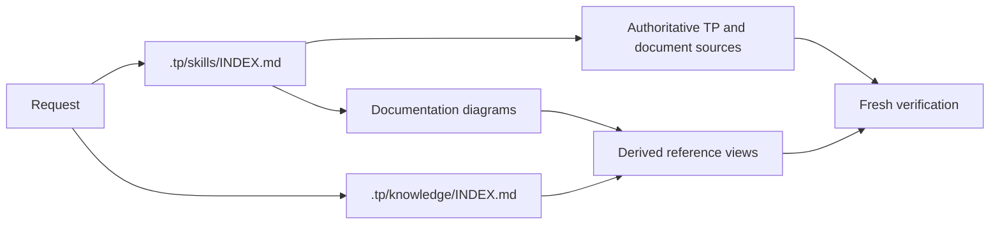

# TP-AgentKit

TP-AgentKit helps an AI agent understand and change unfamiliar semiconductor test programs without forcing them into one directory layout or a fixed workflow.

Give the agent the program, evidence, and outcome you care about. It maps the real launch and dependency paths, proposes a safe change, builds task-specific checks, iterates, and reports what is proven.

## Start

Put the test program and supporting material anywhere inside the workspace, or provide their paths. Then ask naturally:

```text
Update this revision to 0042 and keep the source unchanged.
Apply the approved cold limits from this CSV to the matching program.
Add a companion leakage test beside the existing condition.
Remove this test from the active flow but retain its implementation.
Explain why these tests appear in source but not in the datalog.
Improve this setup sequence without changing measured coverage.
```

Include privacy handling when relevant, for example: `Redact private identifiers.` The agent asks once if that is unclear before broad discovery or maintained evidence writing.

Keep product-specific sources and task evidence outside the Git repository; provide their paths when a task needs them.

## What to expect

- Read-only analysis starts from inspected files and evidence.
- Material edits identify the target, authority, rollback, and verification before mutation.
- Risky work gets a short pressure-test and an approval gate.
- Temporary scripts and checkpoints live under `.tp/work/`; they are working state, not permanent tooling.
- When product understanding should persist, `<PRODUCT>_TP_WIKI.md` links tester-platform metadata, variants and processes, active program paths, and revision evidence to product-scoped companions such as `<PRODUCT>_PRODUCT.md` and `<PRODUCT>_PCMS.md`.
- Completion reports separate verified facts from missing simulator, tester, or production evidence.
- Reusable lessons become living skills or knowledge only after the completed work supports them.

## Guidance map

```text
.tp/
|-- skills/INDEX.md      procedures and task routing
|   `-- create-document-diagrams/SKILL.md documentation figure procedure
|-- knowledge/INDEX.md   verified facts and decision-changing lessons
```



## Future embedding reference

For a future Graphify semantic-clustering path, use `BAAI/bge-small-en-v1.5` as the reference model and `ggml-org/bge-small-en-v1.5-Q8_0-GGUF` as the preferred local GGUF artifact.
The intended contract is 384-dimensional vectors with CLS pooling, L2 normalization, and no query/passage prefix for clustering.
Keep this as a reference while the knowledge dataset is still being optimized; any later implementation must approve the model revision, checksum, license, and output behavior before use.
See [the embedding research note](.tp/knowledge/embedding-model-research.md) for the comparison and validation details.

Agent guidance lives in [`AGENTS.md`](AGENTS.md). The `.tp` directory is intentionally tool-neutral even though it is not a standard agent configuration path.
