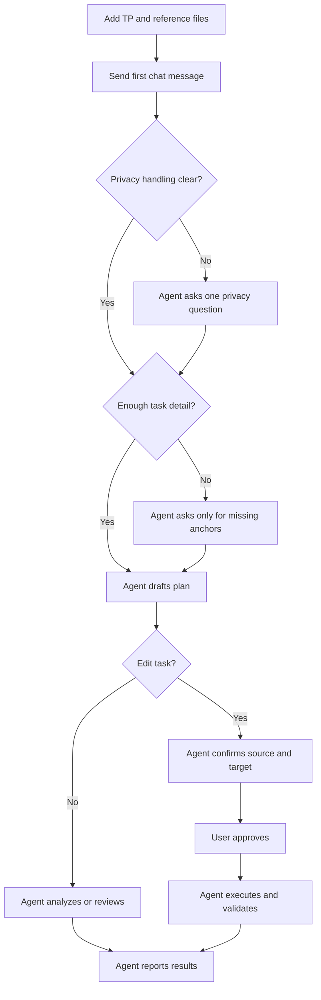

# TP-AgentKit

Protocol-guided toolkit for test program activities. This template enables AI-assisted TP work with shared rules, reusable skills, and explicit approval gates.

---

## Start Here

1. Put your TP folder under `testprogram/`.
2. Put supporting files under `references/`.
3. Decide whether any private identifiers should be excluded or redacted before analysis, previews, or artifacts.
4. Send one chat message with your mode, source TP, task, and privacy handling.

Plain rule: no TP edit happens until you approve the plan.
Plain rule: the agent inspects recoverable facts first and asks only the next decision-relevant question. On riskier work, expect a brief pressure-test rather than a long generic questionnaire.

### Privacy Check

Before TP-AgentKit starts broad discovery or writes maintained artifacts, say whether the agent should exclude or redact private identifiers.
Typical examples: usernames, person names, IP addresses, email addresses, hostnames, or account handles.
If there are no special exclusions, say `Privacy handling: none` or `Privacy handling: no special exclusions`.

### Set Up The Repository

```bash
# Clone or use as template
git clone <template-url> <your-project-name>
cd <your-project-name>

# Copy your test program into testprogram/
# Copy reference materials into references/
```

### Optional Maintainer Python Setup

If you are maintaining the Python skill surfaces under `.claude/skills/`, install the local Python packages you need into the repo venv:

```bash
python -m pip install tiktoken
```

If you also need XLSX-backed result-table support in `tester_result_core`, `tester_result_analyzer`, or the relative ESM validator, install `openpyxl` too:

```bash
python -m pip install openpyxl
```

You may rename the workspace folder to match your activity (e.g., `UQ29_relative_tests/`). This does not affect agent operation.

### Pick A Mode

Use one of these in your first message:

| Mode | Use it when | Agent behavior |
|------|-------------|----------------|
| `analysis-only` | explain, trace, investigate, or understand | no file edits |
| `review-only` | audit, compare, or review for issues | no file edits |
| `edit` | make TP changes in the workspace | plan first, approval required before edits |

### First Message

Generic structured template:

```text
Mode: edit / review-only / analysis-only
Source folder or program: <program or revision folder>
Target handling: use current revision / create copied revision <target>
Inputs: <CSV, workbook, diff, log, screenshot, issue list>
Privacy handling: none / exclude / redact <usernames, person names, IP addresses, emails, hostnames, etc.>
Scope: <limits / flow / code / bins / history / minimal / broad>
Environment or flow: <if known>
Task: <what you want done>
```

Add `Target handling`, `Inputs`, `Privacy handling`, `Scope`, and `Environment or flow` when known. That usually cuts follow-up questions.
If you omit `Privacy handling`, the agent should ask once before broad use or maintained artifact writing.
If you only want a short keyword-style start, use the table below.

---

## Prompt Starters

Use these when you want the shortest workable starting point.

| Starter | Meaning |
|---------|---------|
| `limits csv testprogram/<program_revision> references/<limits file>.csv` | update limits from a CSV |
| `implement SPL testprogram/<program_revision> references/<approved-spl-file>.csv` | review or implement approved YE SPL limits into the TP |
| `review diff testprogram/<old_revision> testprogram/<new_revision>` | review a revision-to-revision delta |
| `release check testprogram/<program_revision>` | audit release readiness |
| `analyze stdf references/stdf/<file>.csv` | summarize tester results |
| `check log references/log/<file>` | triage a log file |
| `add relative tests testprogram/<program_revision>` | update relative-test coverage |
| `special tp screen testprogram/<program_revision>` | prepare a copied special TP |

---

## Workflow



The agent starts with one privacy-handling question when you have not already answered it, asks only for the remaining missing anchors, loads the matching rules and knowledge, drafts a plan, waits for approval before edits, then validates and reports.

When validation is partial on a risky task, the agent should state exactly what was verified, what remains unverified, and how that affects release confidence instead of implying a full pass.

For medium-risk and high-risk tasks, the agent may run a short pressure-test pass after drafting the plan. Expect pointed questions about source of truth, revision safety, variant matching, validation depth, or release confidence before execution.

---

## Workspace Boundaries

Users usually need only these surfaces:

- `testprogram/`
- `references/`
- the chat request
- the approval step for edit work

The `.claude/` area holds framework rules, reusable knowledge, callable skills, command presets, and agent-generated task history. It is primarily a maintainer surface.

If you are maintaining TP-AgentKit itself rather than using it on a TP, start with `AGENTS.md`. This README intentionally does not duplicate the rules, knowledge, skills, task, or artifact guidance maintained under `.claude/`.


---

